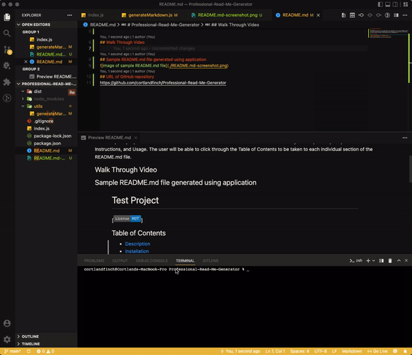
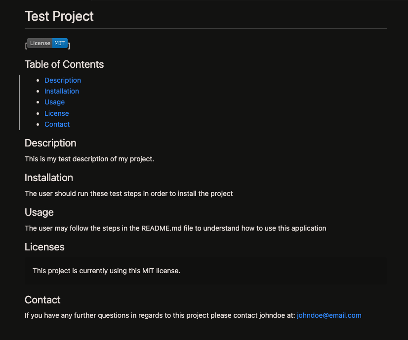

# Professional-Read-Me-Generator

## Description
This project was created for a user to utilize Node.js. It is designed for a user to create a README.md file via the terminal through a series of prompt questions for them to add to their file. The user will be able to add their Project Title, Description, Installation Instructions, and Usage. The user will be able to click through the Table of Contents to be taken to each individual section of the README.md file.

## Walk Through Video

## Sample README.md file generated using application

## URL of GitHub repository
https://github.com/cortlandfinch/Professional-Read-Me-Generator